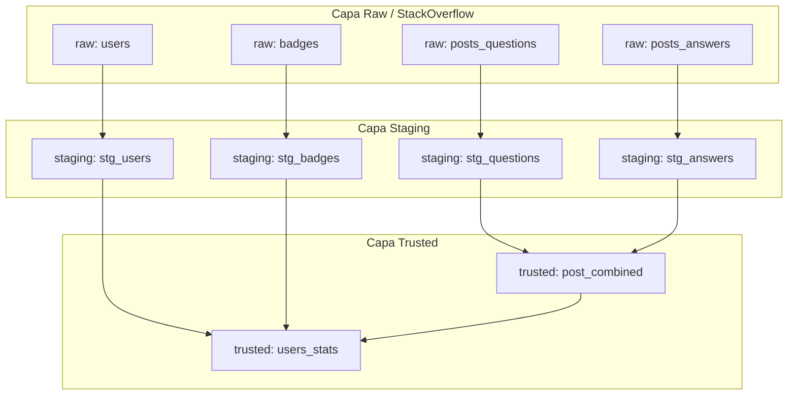

# Dataform Demo

Este repositorio contiene el código de demostración de **Dataform**, diseñado para centralizar, estandarizar y optimizar el ciclo de vida de las transformaciones de datos en **Google BigQuery**.

Sirve como una guía técnica y plantilla para evaluar Dataform como la plataforma central de transformación de datos (similar al rol de DBT).

---

## Objetivos del Proyecto

1.  **Centralización y Estandarización**: Adoptar Dataform y SQLX como la plataforma unificada para el desarrollo, control de versiones, documentación y pruebas de las canalizaciones de transformación de datos.
2.  **Calidad y Gobernanza de Datos**: Implementar aserciones automáticas para garantizar la integridad de los datos antes de que lleguen a las capas de reporte (ej. llaves primarias únicas, condiciones personalizadas).
3.  **Orquestación Eficiente**: Agrupar y programar ejecuciones parciales o completas mediante el uso estratégico de etiquetas (tags).
4.  **Claridad en el Linaje**: Visualizar de forma transparente las dependencias e interacción entre tablas mediante grafos de linaje.

---

## Arquitectura de Capas de Datos

El pipeline de datos sigue un enfoque de buenas prácticas con arquitectura de tres capas (Raw -> Staging -> Trusted) utilizando un conjunto de datos público de StackOverflow como origen.

### Grafo de Linaje de Datos (DAG)



---

## Estructura del Repositorio

```text
/
├── workflow_settings.yaml     # Configuración global de entornos, datasets y versión de Dataform
└── definitions/               # Definiciones de SQLX que componen el pipeline
    ├── raw/                   # Capa Raw (Declaraciones de orígenes de datos externos)
    │   ├── badges.sqlx
    │   ├── posts_answers.sqlx
    │   ├── posts_questions.sqlx
    │   └── users.sqlx
    ├── staging/               # Capa Staging (Limpieza, tipado y filtros iniciales)
    │   ├── stg_answers.sqlx
    │   ├── stg_badges.sqlx
    │   ├── stg_questions.sqlx
    │   └── stg_users.sqlx
    └── trusted/               # Capa Trusted (Modelos agregados, de negocio y listos para BI)
        ├── post_combined.sqlx
        └── users_stats.sqlx
```

---

## Configuración del Proyecto (workflow_settings.yaml)

El archivo principal de configuración define los entornos de ejecución en Google Cloud Platform (GCP) y BigQuery:

*   **Proyecto por defecto (defaultProject):** `andresousa-upskilling`
*   **Dataset por defecto (defaultDataset):** `demo_broxel`
*   **Dataset para Aserciones (defaultAssertionDataset):** `dataform_broxel_assertions`
*   **Versión de Dataform Core (dataformCoreVersion):** `3.0.52`

---

## Detalle de las Capas y Modelos

### 1. Capa Raw (definitions/raw/)
Define las fuentes de datos externas existentes en BigQuery mediante el tipo `declaration`. Esto le permite a Dataform conocer la existencia de estas tablas sin intentar crearlas.
*   `badges.sqlx`: Tabla de medallas de los usuarios.
*   `posts_answers.sqlx`: Tabla de respuestas a preguntas de StackOverflow.
*   `posts_questions.sqlx`: Tabla de preguntas realizadas.
*   `users.sqlx`: Tabla de usuarios registrados.

### 2. Capa Staging (definitions/staging/)
Realiza la limpieza inicial, renombra columnas para estandarización y aplica filtros de optimización de rendimiento (ej. filtrar datos antiguos).
*   **`stg_users.sqlx`** (Table): Filtra y estandariza usuarios. Calcula la antigüedad del usuario (`user_tenure`) en años basándose en la fecha actual.
*   **`stg_badges.sqlx`** (Table): Estandariza campos de medallas (`badge_id`, `badge_name`, `award_timestamp`). Incluye documentación inline a nivel columna en el bloque `config`.
*   **`stg_questions.sqlx`** (View): Filtra preguntas creadas a partir del **1 de enero de 2018** para limitar el tamaño del procesamiento en la demo.
*   **`stg_answers.sqlx`** (View): Filtra respuestas a partir de la misma fecha de corte y castea `parent_id` como tipo `string` para garantizar compatibilidad.

### 3. Capa Trusted (definitions/trusted/)
Genera conjuntos de datos listos para el consumo por herramientas de BI, aplicando uniones complejas, agregaciones de negocio y validación estricta de la calidad del dato.
*   **`post_combined.sqlx`** (Table): Realiza un `UNION ALL` entre preguntas (`stg_questions`) y respuestas (`stg_answers`).
    *   *Optimización*: Está particionada por día mediante `partitionBy: "date(created_at)"` para eficientar costos de consulta.
    *   *Calidad*: Posee una aserción `nonNull` que asegura que ni el identificador del post ni su fecha de creación puedan ser nulos.
*   **`users_stats.sqlx`** (View): Agrega métricas completas por usuario, combinando datos de perfil, volumen de medallas, cantidad total de publicaciones, y fechas del último evento registrado.
    *   *Gobernanza*: Documenta minuciosamente el significado de cada columna directamente en el código de transformación.
    *   *Calidad*: Valida la integridad con dos aserciones integradas:
        *   `uniqueKey: ["user_id"]`: Garantiza que el usuario es único.
        *   `rowConditions: ["badge_count >= 0"]`: Asegura que el conteo de medallas nunca sea negativo.

---

## Orquestación por Etiquetas (Tags)

La orquestación parcial de este pipeline se simplifica mediante etiquetas asignadas en el bloque `config` de los archivos SQLX:

*   **`daily`**: Ejecuta toda la canalización recurrente del día a día. Prácticamente todos los modelos de la capa de staging y trusted cuentan con este tag.
*   **`reporting`**: Diseñado específicamente para actualizar los reportes finales (como `users_stats`), permitiendo ejecutar solo la última capa sin reprocesar de manera forzada pasos previos si no es necesario.

### Ejemplo de Ejecución en BigQuery Dataform:
Para ejecutar únicamente los reportes diarios:
```bash
# Ejemplo conceptual de llamada CLI o a través de la interfaz de BigQuery
dataform run --tags daily
```

---

## Notas Clave de la Sesión y Preguntas Frecuentes

Durante la sesión se discutieron puntos clave sobre las ventajas, limitaciones y mejores prácticas de la herramienta:

### 1. ¿Cómo se maneja la Gobernanza y el Linaje?
Dataform genera un **Grafo de Dependencias** interactivo de manera automática gracias a la función `${ref("nombre_tabla")}`. Esto permite rastrear de dónde proviene cada campo y qué tablas o vistas impactará un cambio en el código de origen.

### 2. ¿Dataform administra Seguridad y Control de Acceso (Enmascaramiento/Permisos)?
**No.** **Dataform se enfoca exclusivamente en el código de transformación (SQLX)**. La gobernanza de accesos, permisos de lectura/escritura y el enmascaramiento de datos personales deben gestionarse fuera de la herramienta, utilizando las políticas de control de accesos nativas de **Google Cloud IAM** y **BigQuery Column-level Security**.

### 3. Enfoque de Repositorio (Mono-repo)
Se destacó como práctica recomendada adoptar un esquema de **"mono-repositorio"** a nivel empresarial para Dataform. Esto facilita la colaboración entre diferentes equipos de datos y evita silos de transformación, permitiendo que todos compartan y referencien las mismas capas de staging y de confianza.

### 4. Optimización de Costos y Rendimiento
Se discutió la importancia de limitar el volumen de escaneo en tablas públicas masivas mediante filtros temporales (como en staging desde `2018-01-01`) y el uso de particionamiento (`partitionBy`) para no elevar los costos de procesamiento de BigQuery innecesariamente.

---

## Próximos Pasos

1.  **Integración con Git**: Conectar este repositorio a su sistema de control de versiones central.
2.  **Configurar CI/CD**: Automatizar las pruebas de calidad (assertions) ante cualquier Pull Request o confirmación en ramas principales.
3.  **Definición de Entornos**: Configurar entornos segregados (Desarrollo, QA, Producción) utilizando las facilidades de parametrización del dataset y proyecto en Dataform.
